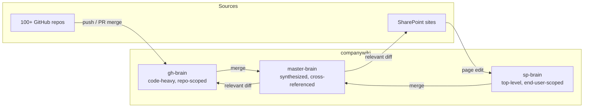
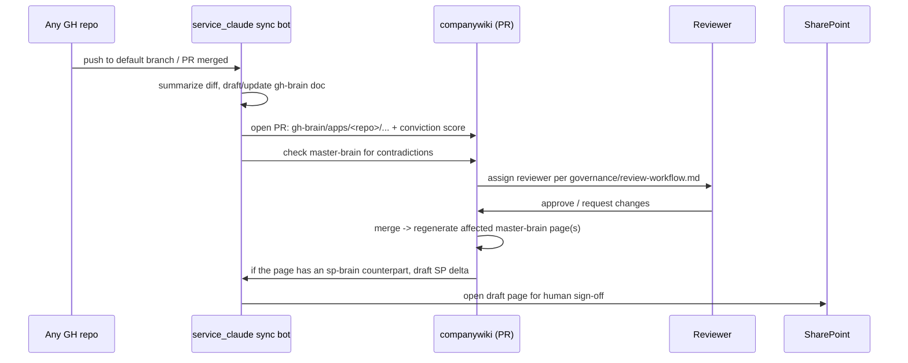
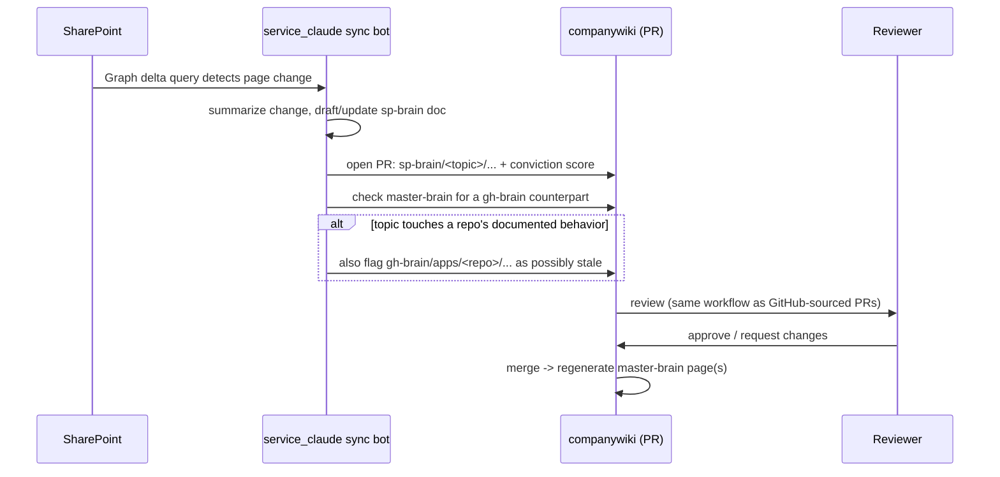

# Architecture

## The three brains

`gh-brain` and `sp-brain` are the two inputs. `master-brain` is the only
place topics get unified, and the layer most queries should hit.

### Why keep gh-brain and sp-brain separate

Different depth, different audience, different owner:

- **gh-brain** is code-heavy: the architecture of a service, why a schema is
  shaped as it is, a decision log per repo. For someone about to touch that
  repo's code. Sourced from pushes and PRs.
- **sp-brain** is top-level: how to use a system, process and policy, org
  context with no natural home in any one repo. For someone who needs the
  *what/how*, not the *why this line of code*. Sourced from SharePoint.

One flat wiki would mean every query wades through the wrong depth half the
time. Keeping them apart lets each stay tuned to its audience;
`master-brain` stitches them per topic when a query spans both.

### Why master-brain is synthesized, not hand-written

"How does the billing service work" has a code-level answer in
`gh-brain/apps/billing-service/` and a policy-level answer in
`sp-brain/billing-process/`. `master-brain/billing.md` cites and reconciles
both. Generating it beats hand-maintaining it, because keeping a third copy
manually in sync with two live sources is exactly the staleness this system
exists to prevent.

## Data flow: GitHub → wiki → SharePoint

**Key point:** the bot never publishes to SharePoint. It drafts; a human
with publish rights accepts. Same asymmetry as code review: automation
proposes, a human with standing disposes.

## Data flow: SharePoint → wiki → GitHub (only when code-relevant)

These two flows form a cycle, and nothing currently breaks it: a wiki merge
drafts a SharePoint edit, publishing it fires the webhook, and the resulting
delta looks like a fresh human change. See `DESIGN-REVIEW.md` D1 before
implementing either direction.
